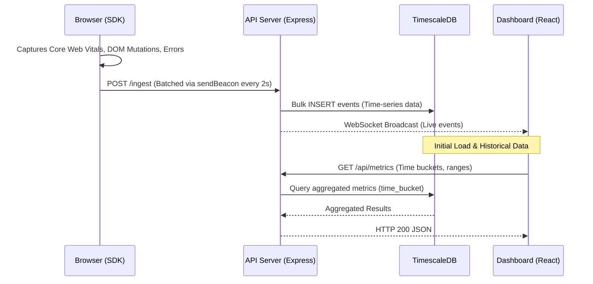

# Browser Performance SDK


## WORKING DEMO OF LIVE PROJECT

https://github.com/user-attachments/assets/8c6aee63-0b26-4f4b-aa68-c583dce8ce50


A lightweight, end-to-end performance monitoring SDK and dashboard. This project functions similarly to a minimal version of Datadog RUM or Sentry, capturing Core Web Vitals, DOM mutations for session replays, and JavaScript errors.

It consists of three main parts:
1. **SDK**: A zero-dependency, vanilla TypeScript script deployed on client websites.
2. **API**: A Node.js + Express ingestion server that processes batched events, inserts them into TimescaleDB, and broadcasts live events.
3. **Dashboard**: A React + Vite frontend to visualize metrics and session replays.

## How it Works (Data Flow)



### Session Lifecycle & Event Timestamps

GitHub natively supports Mermaid charts, which allows us to visualize how events are captured over time during a user session. Here is a timeline representing when metrics and flushes occur:

```mermaid
gantt
    title SDK Event Capture Timeline (Milliseconds)
    dateFormat  x
    axisFormat  %S.%L s

    section Page Load
    Navigation Start       :milestone, nav, 0, 0s
    TTFB (Time to First Byte):milestone, ttfb, 200, 0s
    DOMContentLoaded       :milestone, dcl, 800, 0s

    section Core Web Vitals
    FCP (First Contentful Paint) :milestone, fcp, 1200, 0s
    LCP (Largest Contentful Paint) :milestone, lcp, 2500, 0s
    FID (First Input Delay)      :milestone, fid, 3200, 0s

    section SDK Batching
    Queueing Events        :active, q1, 0, 2000
    Flush 1 (sendBeacon)   :milestone, f1, 2000, 0s
    Queueing Events        :active, q2, 2000, 4000
    Flush 2 (sendBeacon)   :milestone, f2, 4000, 0s
    Visibility Hidden      :milestone, hide, 4500, 0s
    Final Flush (sendBeacon) :milestone, final, 4500, 0s
```



## Running Locally

Requirements:
- Node.js (v20+)
- Docker and Docker Compose

1. **Start the Database and API:**
   ```bash
   docker-compose up --build
   ```
   This will spin up TimescaleDB and the Express ingestion API.

2. **Build the SDK:**
   ```bash
   cd sdk
   npm install
   npm run build
   ```

3. **Test the Pipeline:**
   Open `test.html` in your browser. Interact with the page to trigger events, which will be batched and sent to the API.

## Architecture Decision Records

**Why Vanilla JS over React for the SDK?**
The SDK runs on third-party sites with unknown tech stacks. A framework dependency risks version conflicts and bundle bloat. Vanilla JS keeps the script tag under 2KB gzipped and introduces zero risk to the host page.

**Why navigator.sendBeacon over fetch?**
`fetch()` is cancelled when the tab closes. `sendBeacon()` is guaranteed delivery even on unload — critical for capturing the final LCP value and flushing the event queue.

**Why TimescaleDB over plain PostgreSQL?**
Performance data is append-only time-series. TimescaleDB hypertables auto-partition by time, compress ~90% better than standard Postgres for this access pattern, and use `time_bucket()` for aggregations that are 10-100x faster on time ranges.

**Why batched beacons over per-event sends?**
Individual sends on a JS-heavy page causes request storms. Batching with a 2s debounce reduces network requests by ~90% while keeping dashboard data fresh enough for real-time display.

**Why in-memory rate limiting over Redis?**
Single-instance deployment. For horizontal scaling, replace `rateLimit.ts` with a Redis sliding window counter using `INCR` + `EXPIRE`.

## Benchmarks
- **Ingestion throughput**: Tested at ~6,500 requests/second using `k6`.
- **Ingestion p99 latency**: 67.39 ms (p95 = 63.83 ms) under peak load with 50 concurrent virtual users inserting bulk rows into TimescaleDB.
